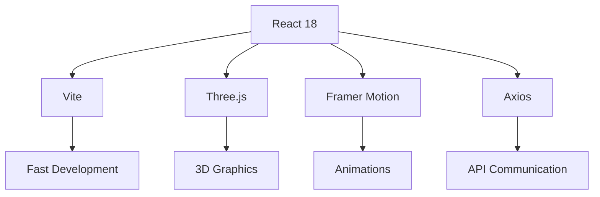
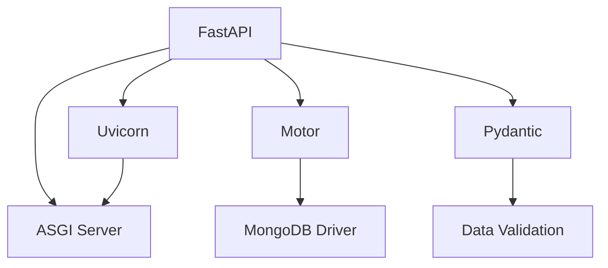

# Pranjal Portfolio

<div align="center">

[](https://opensource.org/licenses/MIT)
[](https://reactjs.org/)
[](https://fastapi.tiangolo.com/)
[](https://www.mongodb.com/)
[](https://threejs.org/)
[](https://vitejs.dev/)

**A Stunning Full-Stack Portfolio Showcasing The Artistry Of Pranjal, A Visionary Visual Storyteller**

</div>

---

## Overview

Welcome To The Digital Showcase Of Pranjal, Where Creativity Meets Technology. This Sophisticated Full-Stack Web Application Presents A Mesmerizing Portfolio Experience Featuring Immersive 3D Visualizations, Seamless Animations, And A Comprehensive Content Management System.

**Specialized In**: Photography • Videography • Video Editing  
**Built With**: Modern Web Technologies  
**Copyright Protected**: All Content © Pranjal

## Features

### Frontend Portfolio

<div align="center">

| Feature | Description |
|---------|-------------|
| **3D Immersion** | Interactive Three.js Background With Dynamic Scroll Effects |
| **Responsive Design** | Flawless Experience Across All Devices And Screen Sizes |
| **Smooth Animations** | Framer Motion-Powered Transitions For Engaging Interactions |
| **Portfolio Galleries** | Dedicated Sections For Photography, Videography, And Video Editing |
| **Contact Integration** | Seamless Contact Form With Real-Time Backend Processing |
| **Analytics Tracking** | Intelligent Page Visit Monitoring For Performance Insights |

</div>

### Admin Panel

<div align="center">

| Feature | Description |
|---------|-------------|
| **Secure Access** | JWT-Based Authentication System For Admin Protection |
| **Content Management** | Intuitive Interface For Portfolio Content Administration |
| **File Upload** | Drag-And-Drop Upload System For Media Files |
| **Profile Control** | Dynamic Personal Information And Biography Management |
| **Message Center** | Comprehensive Contact Form Submission Management |
| **Dashboard Analytics** | Real-Time Insights And Management Overview |

</div>

### Backend API

<div align="center">

| Feature | Description |
|---------|-------------|
| **RESTful Architecture** | Comprehensive API Endpoints For All Portfolio Operations |
| **Security First** | Robust Authentication And Authorization With JWT |
| **Media Handling** | Efficient File Upload And Storage Solutions |
| **Database Integration** | MongoDB For Flexible And Scalable Data Management |
| **Email Services** | SMTP Integration For Contact Form Notifications |
| **CORS Enabled** | Seamless Cross-Origin Communication Support |

</div>

## Tech Stack

### Frontend


- **React 18** - Modern Component-Based UI Framework
- **Vite** - Lightning-Fast Build Tool And Dev Server
- **Three.js** - Powerful 3D Graphics Library
- **Framer Motion** - Production-Ready Animation Library
- **Axios** - Promise-Based HTTP Client
- **React Router** - Declarative Routing For React


### Backend


- **FastAPI** - High-Performance Python Web Framework
- **Uvicorn** - Lightning-Fast ASGI Server
- **Motor** - Asynchronous MongoDB Driver
- **Pydantic** - Data Validation And Settings
- **Python-Jose** - JSON Web Token Implementation
- **Passlib** - Secure Password Hashing
- **Cloudinary SDK** - Cloud Media Storage & Serving

### 🗄️ Database & Infrastructure
- **MongoDB** - NoSQL Document Database
- **Nginx** - High-Performance Web Server
- **Cloudinary** - Cloud Storage For Images & Videos
- **YouTube** - Video Hosting & Streaming (for external videos)

## Architecture

```
Pranjal-Portfolio/
├── Frontend/          # React Portfolio Application
│   ├── Pages/         # Portfolio Display Pages
│   ├── Components/    # Reusable UI Components
│   └── Services/      # API Integration Layer
├── Admin/             # React Admin Panel
│   ├── Dashboard/     # Management Interface
│   ├── Upload/        # File Management
│   └── Auth/          # Authentication System
├── Backend/           # FastAPI Server
│   ├── API/           # REST Endpoints
│   ├── Database/      # Data Models & Connections
│   └── Security/      # Authentication & Authorization
└── Nginx/             # Production Server Config
```

## 📋 Prerequisites

Before You Begin, Ensure You Have These Installed:

- **Python 3.8+** - Backend Runtime
- **Node.js 18+** - Frontend Runtime
- **MongoDB 4.6+** - Database Server
-  **Git** - Version Control

## 🚀 Quick Start

### ⚡ Development Setup

1. **Clone The Repository**
   ```bash
   git clone https://github.com/pranjal/pranjal-portfolio.git
   cd pranjal-portfolio
   ```


3. **Environment Setup**
   ```bash
   cd Backend
   cp .env.example .env
   # Edit .env With Your Configuration
   ```

4. **Launch Services**
   ```bash
   # Terminal 1: Start MongoDB
   mongod

   # Terminal 2: Start Backend
   cd Backend && pip install -r Requirements.txt
   uvicorn App.Main:app --reload

   # Terminal 3: Start Frontend
   cd Frontend && npm install && npm start

   # Terminal 4: Start Admin
   cd Admin && npm install && npm start
   ```

5. **Access Applications**
   - **Portfolio**: http://localhost:5173
   - **Admin Panel**: http://localhost:5174
   - **API Docs**: http://localhost:8000/docs

## ⚙️ Configuration

### 🔧 Environment Variables

Create A `.env` File In The Backend Directory:

```env
# Database Configuration
MONGODB_URL=mongodb://localhost:27017
DATABASE_NAME=pranjal_portfolio

# Security Settings
JWT_SECRET=Your-Super-Secret-JWT-Key
JWT_ALGORITHM=HS256
ACCESS_TOKEN_EXPIRE_MINUTES=1440


# Cloudinary Configuration
CLOUDINARY_CLOUD_NAME=your-cloud-name
CLOUDINARY_API_KEY=your-api-key
CLOUDINARY_API_SECRET=your-api-secret

# Admin Credentials
ADMIN_EMAIL=admin@pranjal.com
ADMIN_PASSWORD=Secure-Admin-Password

# Email Configuration
SMTP_HOST=smtp.gmail.com
SMTP_PORT=587
SMTP_USER=Your-Email@gmail.com
SMTP_PASSWORD=Your-App-Password

# Application URLs
FRONTEND_URL=http://localhost:3000
ADMIN_URL=http://localhost:3001
BACKEND_URL=http://localhost:8000


# File Management
MAX_FILE_SIZE=104857600

# CORS Settings
CORS_ORIGINS=http://localhost:3000,http://localhost:3001

# Environment Mode
ENVIRONMENT=development
```

## 📖 API Documentation

The Backend Provides Interactive API Documentation:

- **Swagger UI**: `http://localhost:8000/docs`
- **ReDoc**: `http://localhost:8000/redoc`

### 🎯 Key Endpoints

| Method | Endpoint | Description |
|--------|----------|-------------|
| `POST` | `/auth/login` | Admin Authentication |
| `GET` | `/profile` | Get Profile Information |
| `GET` | `/photos` | Get Photo Projects |
| `GET` | `/videos` | Get Video Projects |
| `GET` | `/edits` | Get Edit Projects |
| `POST` | `/contact` | Submit Contact Form |


## 📚 Documentation

- **[Migration Guide](./MIGRATION_GUIDE.md)** - Migrate from old URL system to Cloudinary
- **[API Documentation](http://localhost:8000/docs)** - Interactive API reference
| `POST` | `/photos/upload` | Upload Photography |
| `POST` | `/videos/upload` | Upload Videography |
| `POST` | `/edits/upload` | Upload Video Edits |
| `POST` | `/contact` | Submit Contact Form |
| `GET` | `/analytics` | Get Analytics Data |

##  License

This Project Is Licensed Under The MIT License - See The [LICENSE](LICENSE) File For Details.

**© 2025 Pranjal Portfolio. All Rights Reserved.**

This Portfolio Showcases The Work Of Pranjal, A Talented Photographer, Videographer, And Video Editor. All Content And Media Belongs To Pranjal And Is Protected Under Copyright Law.
