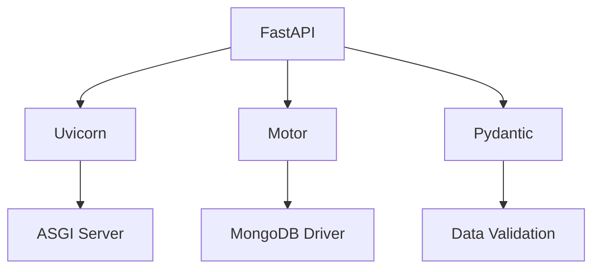

# 🎨 Pranjal Portfolio

<div align="center">

[](https://opensource.org/licenses/MIT)
[](https://reactjs.org/)
[](https://fastapi.tiangolo.com/)
[](https://www.mongodb.com/)
[](https://threejs.org/)
[](https://vitejs.dev/)

**A Stunning Full-Stack Portfolio Showcasing The Artistry Of Pranjal, A Visionary Visual Storyteller**

</div>

---

## ✨ Overview

Welcome To The Digital Showcase Of Pranjal, Where Creativity Meets Technology. This Sophisticated Full-Stack Web Application Presents A Mesmerizing Portfolio Experience Featuring Immersive 3D Visualizations, Seamless Animations, And A Comprehensive Content Management System.

🎯 **Specialized In** : Photography • Videography • Video Editing  
🚀 **Built With** : Modern Web Technologies  
🔒 **Copyright Protected** : All Content © Pranjal

## ✨ Features

### 🎨 Frontend Portfolio

<div align="center">

| Feature | Description |
|---------|-------------|
| 🌟 **3D Immersion** | Interactive Three.js Background With Dynamic Scroll Effects |
| 📱 **Responsive Design** | Flawless Experience Across All Devices And Screen Sizes |
| 🎭 **Smooth Animations** | Framer Motion-Powered Transitions For Engaging Interactions |
| 📸 **Portfolio Galleries** | Dedicated Sections For Photography, Videography, And Video Editing |
| 📝 **Contact Integration** | Seamless Contact Form With Real-Time Backend Processing |
| 📊 **Analytics Tracking** | Intelligent Page Visit Monitoring For Performance Insights |

</div>

### 🔧 Admin Panel

<div align="center">

| Feature | Description |
|---------|-------------|
| 🔐 **Secure Access** | JWT-Based Authentication System For Admin Protection |
| 🎛️ **Content Management** | Intuitive Interface For Portfolio Content Administration |
| 📤 **File Upload** | Drag-And-Drop Upload System For Media Files |
| 👤 **Profile Control** | Dynamic Personal Information And Biography Management |
| 💬 **Message Center** | Comprehensive Contact Form Submission Management |
| 📈 **Dashboard Analytics** | Real-Time Insights And Management Overview |

</div>

### ⚡ Backend API

<div align="center">

| Feature | Description |
|---------|-------------|
| 🔌 **RESTful Architecture** | Comprehensive API Endpoints For All Portfolio Operations |
| 🛡️ **Security First** | Robust Authentication And Authorization With JWT |
| 📁 **Media Handling** | Efficient File Upload And Storage Solutions |
| 🗄️ **Database Integration** | MongoDB For Flexible And Scalable Data Management |
| 📧 **Email Services** | SMTP Integration For Contact Form Notifications |
| 🌐 **CORS Enabled** | Seamless Cross-Origin Communication Support |

</div>

## 🛠️ Tech Stack

### 🎨 Frontend


- **⚛️ React 18** - Modern Component-Based UI Framework
- **⚡ Vite** - Lightning-Fast Build Tool And Dev Server
- **🎲 Three.js** - Powerful 3D Graphics Library
- **🎭 Framer Motion** - Production-Ready Animation Library
- **📡 Axios** - Promise-Based HTTP Client
- **🧭 React Router** - Declarative Routing For React

### 🔧 Backend


- **🚀 FastAPI** - High-Performance Python Web Framework
- **⚡ Uvicorn** - Lightning-Fast ASGI Server
- **🍃 Motor** - Asynchronous MongoDB Driver
- **📋 Pydantic** - Data Validation And Settings
- **🔐 Python-Jose** - JSON Web Token Implementation
- **🔒 Passlib** - Secure Password Hashing

### 🗄️ Database & Infrastructure
- **🍃 MongoDB** - NoSQL Document Database
- **🌐 Nginx** - High-Performance Web Server

## 🏗️ Architecture

```
Pranjal-Portfolio/
├── 🎨 Frontend/          # React Portfolio Application
│   ├── 📱 Pages/         # Portfolio Display Pages
│   ├── 🧩 Components/    # Reusable UI Components
│   └── 🎯 Services/      # API Integration Layer
├── 🔧 Admin/             # React Admin Panel
│   ├── 📊 Dashboard/     # Management Interface
│   ├── 📤 Upload/        # File Management
│   └── 🔐 Auth/          # Authentication System
├── ⚙️ Backend/           # FastAPI Server
│   ├── 🔌 API/           # REST Endpoints
│   ├── 🗄️ Database/      # Data Models & Connections
│   └── 🛡️ Security/      # Authentication & Authorization
└── 🌐 Nginx/             # Production Server Config
```

## 📋 Prerequisites

Before You Begin, Ensure You Have These Installed:

- 🐍 **Python 3.8+** - Backend Runtime
- 🟢 **Node.js 18+** - Frontend Runtime
- 🍃 **MongoDB 4.6+** - Database Server
-  **Git** - Version Control

## 🚀 Quick Start

### ⚡ Development Setup

1. **Clone The Repository**
   ```bash
   git clone https://github.com/pranjal/pranjal-portfolio.git
   cd pranjal-portfolio
   ```

2. **Environment Setup**
   ```bash
   cp .env.example .env
   # Edit .env With Your Configuration
   ```

3. **Launch Services**
   ```bash
   # Terminal 1: Start MongoDB
   mongod

   # Terminal 2: Start Backend
   cd Backend && pip install -r Requirements.txt
   uvicorn App.Main:app --reload

   # Terminal 3: Start Frontend
   cd Frontend && npm install && npm start

   # Terminal 4: Start Admin
   cd Admin && npm install && npm start
   ```

4. **Access Applications**
   - 🌐 **Portfolio**: http://localhost:3000
   - 🔧 **Admin Panel**: http://localhost:3001
   - 📚 **API Docs**: http://localhost:8000/docs

## ⚙️ Configuration

### 🔧 Environment Variables

Create A `.env` File In The Backend Directory:

```env
# Database Configuration
MONGODB_URL=mongodb://localhost:27017
DATABASE_NAME=pranjal_portfolio

# Security Settings
JWT_SECRET=Your-Super-Secret-JWT-Key
JWT_ALGORITHM=HS256
ACCESS_TOKEN_EXPIRE_MINUTES=1440

# Admin Credentials
ADMIN_EMAIL=admin@pranjal.com
ADMIN_PASSWORD=Secure-Admin-Password

# Email Configuration
SMTP_HOST=smtp.gmail.com
SMTP_PORT=587
SMTP_USER=Your-Email@gmail.com
SMTP_PASSWORD=Your-App-Password

# Application URLs
FRONTEND_URL=http://localhost:3000
ADMIN_URL=http://localhost:3001
BACKEND_URL=http://localhost:8000

# File Management
MAX_FILE_SIZE=104857600
UPLOAD_DIRECTORY=./Uploads

# CORS Settings
CORS_ORIGINS=http://localhost:3000,http://localhost:3001

# Environment Mode
ENVIRONMENT=development
```

## 📖 API Documentation

The Backend Provides Interactive API Documentation:

- 📋 **Swagger UI**: `http://localhost:8000/docs`
- 📖 **ReDoc**: `http://localhost:8000/redoc`

### 🎯 Key Endpoints

| Method | Endpoint | Description |
|--------|----------|-------------|
| `POST` | `/auth/login` | 🔐 Admin Authentication |
| `GET` | `/profile` | 👤 Get Profile Information |
| `POST` | `/photos/upload` | 📸 Upload Photography |
| `POST` | `/videos/upload` | 🎬 Upload Videography |
| `POST` | `/edits/upload` | ✂️ Upload Video Edits |
| `POST` | `/contact` | 📧 Submit Contact Form |
| `GET` | `/analytics` | 📊 Get Analytics Data |

##  License

This Project Is Licensed Under The MIT License - See The [LICENSE](LICENSE) File For Details.

**© 2025 Pranjal Portfolio. All Rights Reserved.**

**🎨 This Portfolio Showcases The Work Of Pranjal, A Talented Photographer, Videographer, And Video Editor. All Content And Media Belongs To Pranjal And Is Protected Under Copyright Law.**
